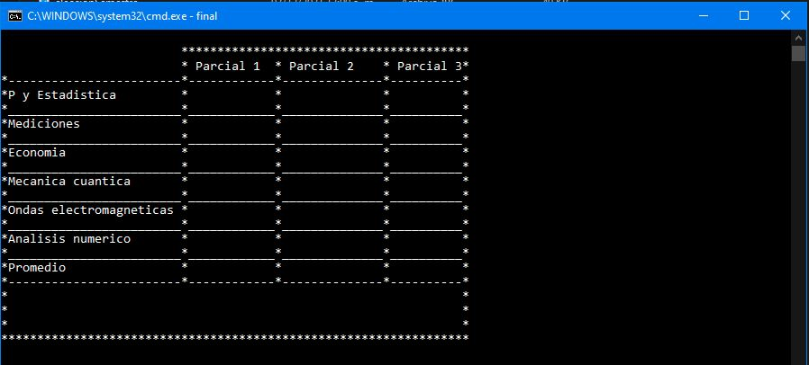

# Boleta-de-calificaciones
Programa en C++ que ayuda a obtener el promedio de un alumno en determinado semestre, mostrando si esta aprobado o no.

----

Al inicio se debera elegir el semestre que cursa el alumno

Aparecera el formulario para ingresar los datos del alumno

Una vez llenados los datos se preguntara sí están correctos

Apareceran las materias y se deberan ir rellenando en caso de que se reciba una calificación < a 0 "0" mayor a 10 al final el programa regresará a esa casilla para corregir el dato

Una vez llenada la tabla aparecerá por un momento el promedio general y sí el alumno esta aprobado o no.

Finalmente aparecerán los datos en limpio, así mismo se podrá calcular otra boleta. 

